# Staria Properties Enterprise Database Design

This design is normalized to 3NF for a real-estate website with CMS and role-based administration. Images, PDFs, and uploaded files are stored in Cloudinary; PostgreSQL stores only Cloudinary metadata and URLs through `media_assets`.

## ER Diagram

```mermaid
erDiagram
  ADMIN_USERS ||--o{ ADMIN_USER_ROLES : assigned
  ROLES ||--o{ ADMIN_USER_ROLES : contains
  ROLES ||--o{ ROLE_PERMISSIONS : grants
  PERMISSIONS ||--o{ ROLE_PERMISSIONS : included
  ADMIN_USERS ||--o{ MEDIA_ASSETS : uploads
  ADMIN_USERS ||--o{ AUDIT_LOGS : performs
  ADMIN_USERS ||--o{ ADMIN_SESSIONS : owns
  ADMIN_USERS ||--o{ ADMIN_PASSWORD_RESET_TOKENS : requests
  ADMIN_USERS ||--o{ ADMIN_EMAIL_VERIFICATION_TOKENS : verifies
  ADMIN_SESSIONS ||--o{ ADMIN_SESSIONS : rotates_to

  MEDIA_ASSETS ||--o{ CATEGORY_MEDIA : used_by
  MEDIA_ASSETS ||--o{ PROPERTY_MEDIA : used_by
  MEDIA_ASSETS ||--o{ PROJECT_MEDIA : used_by
  MEDIA_ASSETS ||--o{ SERVICE_MEDIA : used_by
  MEDIA_ASSETS ||--o{ GALLERY_ITEMS : renders
  MEDIA_ASSETS ||--o{ CERTIFICATE_MEDIA : attaches
  MEDIA_ASSETS ||--o{ CLIENT_MEDIA : brands
  MEDIA_ASSETS ||--o{ PARTNER_MEDIA : brands
  MEDIA_ASSETS ||--o{ FACTORY_MEDIA : shows
  MEDIA_ASSETS ||--o{ HERO_SLIDES : background
  MEDIA_ASSETS ||--o{ DOWNLOADS : file
  MEDIA_ASSETS ||--o{ SEO_METADATA : og_image

  PAGES ||--o{ PAGE_SECTIONS : owns
  PAGE_SECTIONS ||--o{ PAGE_SECTION_ITEMS : owns
  PAGES ||--o{ HERO_SLIDES : owns
  PAGES ||--o| SEO_METADATA : has

  CATEGORIES ||--o{ CATEGORIES : parent_child
  CATEGORIES ||--o{ PROPERTY_CATEGORIES : groups
  PROPERTIES ||--o{ PROPERTY_CATEGORIES : classified
  PROPERTIES ||--o{ PROPERTY_MEDIA : has
  PROPERTIES ||--o| SEO_METADATA : has
  PROJECTS ||--o{ PROPERTIES : contains
  PROJECTS ||--o{ PROJECT_MEDIA : has
  PROJECTS ||--o| SEO_METADATA : has
  AMENITIES ||--o{ PROPERTY_AMENITIES : assigned
  PROPERTIES ||--o{ PROPERTY_AMENITIES : has
  AMENITIES ||--o{ PROJECT_AMENITIES : assigned
  PROJECTS ||--o{ PROJECT_AMENITIES : has

  CATEGORIES ||--o{ SERVICES : groups
  SERVICES ||--o{ SERVICE_MEDIA : has
  SERVICES ||--o| SEO_METADATA : has

  CATEGORIES ||--o{ GALLERY_ALBUMS : groups
  GALLERY_ALBUMS ||--o{ GALLERY_ITEMS : contains
  GALLERY_ALBUMS ||--o| SEO_METADATA : has

  CERTIFICATES ||--o{ CERTIFICATE_MEDIA : has
  CLIENTS ||--o{ CLIENT_CONTACTS : has
  CLIENTS ||--o{ CLIENT_MEDIA : has
  CLIENTS ||--o{ TESTIMONIALS : gives
  CLIENT_CONTACTS ||--o{ TESTIMONIALS : gives
  PARTNERS ||--o{ PARTNER_MEDIA : has

  CATEGORIES ||--o{ BLOG_POSTS : groups
  ADMIN_USERS ||--o{ BLOG_POSTS : authors
  BLOG_POSTS ||--o{ BLOG_POST_TAGS : tagged
  BLOG_TAGS ||--o{ BLOG_POST_TAGS : labels

  DEPARTMENTS ||--o{ JOB_POSTINGS : owns
  JOB_POSTINGS ||--o{ JOB_APPLICATIONS : receives

  ADDRESSES ||--o| FACTORIES : locates
  FACTORIES ||--o{ FACTORY_CAPABILITIES : has
  FACTORIES ||--o{ FACTORY_MEDIA : has
  ADDRESSES ||--o| CONTACT_LOCATIONS : locates

  ADMIN_USERS ||--o{ CONTACT_MESSAGES : assigned
  ADMIN_USERS ||--o{ QUOTATION_REQUESTS : assigned
  ADMIN_USERS ||--o{ QUOTATION_CONVERSATIONS : authors
  QUOTATION_REQUESTS ||--o{ QUOTATION_REQUEST_ITEMS : contains
  QUOTATION_REQUESTS ||--o{ QUOTATION_CONVERSATIONS : records
  PROPERTIES ||--o{ QUOTATION_REQUEST_ITEMS : requested
  CATEGORIES ||--o{ QUOTATION_REQUEST_ITEMS : requested
  MEASUREMENT_UNITS ||--o{ QUOTATION_REQUEST_ITEMS : measures

  NEWSLETTER_CAMPAIGNS ||--o{ NEWSLETTER_CAMPAIGN_RECIPIENTS : sends
  NEWSLETTER_SUBSCRIBERS ||--o{ NEWSLETTER_CAMPAIGN_RECIPIENTS : receives
  ADMIN_USERS ||--o{ NEWSLETTER_CAMPAIGNS : creates

  CATEGORIES ||--o{ DOWNLOADS : groups
```



The standalone Mermaid source is also available in `src/docs/er-diagram.mmd`.

## Normalization

- `media_assets` centralizes Cloudinary URLs and upload metadata. Property, project, service, gallery, certificate, client, partner, factory, hero, SEO, download, and resume references use FKs or join tables.
- `seo_metadata` is centralized with one optional one-to-one relation per SEO-enabled entity, avoiding duplicated `metaTitle`, `metaDescription`, and `ogImage` columns.
- `categories` is shared across property, project, service, blog, gallery, and download contexts using `category_type`.
- RBAC is 3NF: users, roles, permissions, and two pure join tables.
- Admin authentication is normalized through `admin_sessions`, `admin_password_reset_tokens`, and `admin_email_verification_tokens`; token values are never stored raw.
- Repeating amenities, factory capabilities, quotation line items, gallery images, and newsletter campaign recipients are represented through child or join tables.
- Soft deletes use `deleted_at` on user-facing/admin-managed master records. Transaction rows keep status fields and timestamps.

## Core Relationships

| Domain | Relationship | Foreign Key | Rule |
|---|---|---|---|
| RBAC | `admin_users` to `roles` | `admin_user_roles.admin_user_id`, `role_id` | Cascade join rows |
| RBAC | `roles` to `permissions` | `role_permissions.role_id`, `permission_id` | Cascade join rows |
| Auth | Admin sessions | `admin_sessions.admin_user_id` | Cascade |
| Auth | Refresh rotation link | `admin_sessions.replaced_by_session_id` | Set null |
| Auth | Password reset tokens | `admin_password_reset_tokens.admin_user_id` | Cascade |
| Auth | Email verification tokens | `admin_email_verification_tokens.admin_user_id` | Cascade |
| Media | Upload owner | `media_assets.uploaded_by_id` | Set null if admin deleted |
| Pages | Page sections | `page_sections.page_id` | Cascade |
| Pages | Section items | `page_section_items.section_id` | Cascade |
| Pages | Hero slides | `hero_slides.page_id` | Cascade |
| Pages | Hero image | `hero_slides.media_id` | Restrict |
| Categories | Parent category | `categories.parent_id` | Set null |
| Properties | Property categories | `property_categories.property_id` | Cascade |
| Properties | Property category target | `property_categories.category_id` | Restrict |
| Properties | Property images | `property_media.property_id` | Cascade |
| Properties | Property image asset | `property_media.media_id` | Restrict |
| Properties | Project/address refs | `project_id`, `address_id` | Set null |
| Projects | Project images | `project_media.project_id` | Cascade |
| Projects | Project image asset | `project_media.media_id` | Restrict |
| Amenities | Property/project joins | `property_amenities`, `project_amenities` | Cascade joins |
| Services | Service category | `services.category_id` | Set null |
| Gallery | Album items | `gallery_items.album_id` | Cascade |
| Gallery | Item image | `gallery_items.media_id` | Restrict |
| Certificates | Certificate files/images | `certificate_media.certificate_id` | Cascade |
| Clients | Client contacts | `client_contacts.client_id` | Set null |
| Testimonials | Client/contact refs | `client_id`, `client_contact_id` | Set null |
| Blog | Post category/author | `category_id`, `author_id` | Set null |
| Blog | Tags | `blog_post_tags.blog_post_id`, `blog_tag_id` | Cascade join rows |
| Career | Department jobs | `job_postings.department_id` | Set null |
| Career | Job applications | `job_applications.job_posting_id` | Cascade |
| Factory | Factory address | `factories.address_id` | Set null |
| Factory | Capabilities/media | `factory_id` | Cascade |
| Contact | Assigned admin | `contact_messages.assigned_to_id` | Set null |
| Quote | Assigned admin | `quotation_requests.assigned_to_id` | Set null |
| Quote | Line items | `quotation_request_items.quotation_request_id` | Cascade |
| Quote | Property/category/unit refs | `property_id`, `category_id`, `unit_id` | Set null |
| Quote | Conversation timeline | `quotation_conversations.quotation_request_id` | Cascade |
| Quote | Conversation admin author | `quotation_conversations.admin_user_id` | Set null |
| Newsletter | Campaign recipients | `newsletter_campaign_recipients.campaign_id`, `subscriber_id` | Cascade |
| Downloads | PDF file | `downloads.file_media_id` | Restrict |
| SEO | Entity SEO records | entity-specific FK | Cascade |
| SEO | Open graph image | `seo_metadata.og_image_id` | Set null |

## Index Strategy

Primary and unique indexes:

- UUID primary keys on every table.
- Unique slugs on public entities: categories scoped by type, pages, properties, projects, amenities, services, gallery albums, certificates, clients, partners, blog posts, tags, departments, job postings, factories, downloads.
- Unique operational keys: `admin_users.email`, `permissions(resource, action)`, `properties.reference_code`, `quotation_requests.request_no`, `newsletter_subscribers.email`, `media_assets.cloudinary_public_id`.
- Composite primary keys on join tables: RBAC joins, media joins, property-category and amenity joins, blog tag joins, newsletter recipients.

High-traffic query indexes:

- Publication/status: `status`, `is_featured`, `published_at`, `sort_order`.
- Soft delete filters: `deleted_at` on soft-deletable records.
- Admin queues: contact messages by `(status, created_at)`, quotation requests by `(status, created_at)`, job applications by `(job_posting_id, status)`.
- Category browsing: `categories(category_type, status, sort_order)`, plus parent category index.
- Media browsing: `media_assets(resource_type, deleted_at)`, `uploaded_by_id`, `created_at`.
- SEO one-to-one lookups: unique nullable FK per SEO-enabled entity.
- Audit lookup: `(actor_id, created_at)`, `(entity_type, entity_id)`, `action`.

## Cascade Rules

Use `Cascade` only when child rows have no meaning without the parent:

- Page sections/items, property/project media and amenity joins, gallery items, certificate media, factory capabilities, quote line items, campaign recipients, RBAC join rows.

Use `SetNull` when history should survive:

- Uploaded media owner, blog author, assigned admin, testimonial client/contact, job department, quotation item property/category/unit, SEO OG image.

Use `Restrict` for Cloudinary media that is still referenced:

- Property/project/service/gallery/client/partner/certificate/factory media, hero slide media, download file media.

## Prisma Schema

The implemented Prisma schema is in:

```text
backend/prisma/schema.prisma
```

It has been validated with:

```bash
npx prisma validate
```
